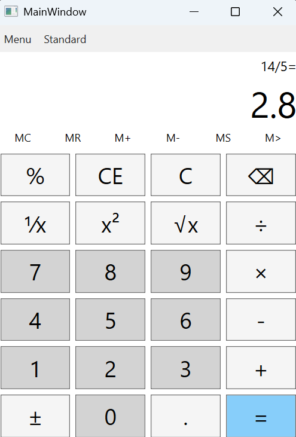
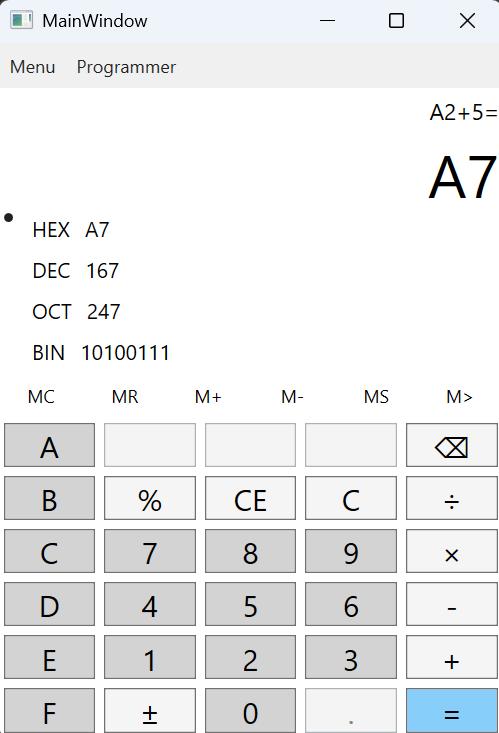
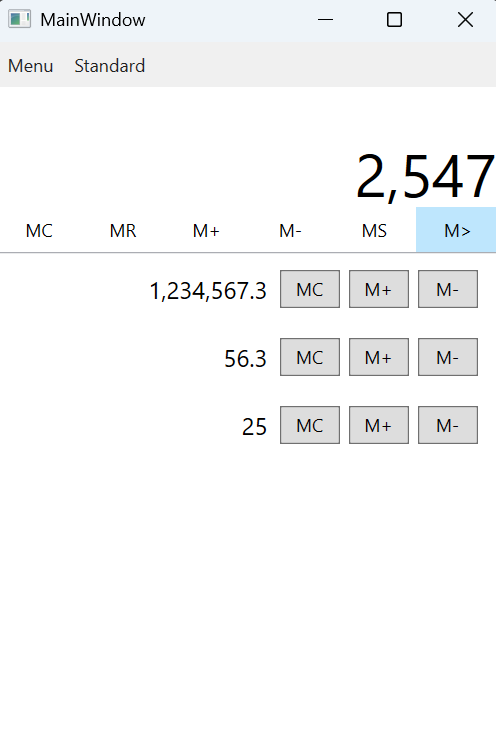

# C# WPF Calculator  

## Overview  
This project is a **calculator app** built using **C# and WPF**, following the **MVVM** design pattern.  
It features **Standard** and **Programmer** modes with a sleek, modern UI.  

### ✨ Features  
✅ **Modern Design** – Clean, user-friendly UI.  
✅ **MVVM Architecture** – Ensures maintainability and scalability.  
✅ **Standard Mode** – Supports basic arithmetic operations.  

✅ **Programmer Mode** – Includes number base conversions.  

✅ **Memory Functions** – Store, restore, add, subtract, clear, and manage memory list.  

✅ **Base Selection** – Work in binary, octal, decimal, or hexadecimal.  
✅ **Clipboard Operations** – **Cut, Copy, and Paste** support.  
✅ **Digit Grouping** – Configurable for **UK** and **RO** formats.  
✅ **Settings Persistence** – Stores **digit grouping, calculator mode, and base selection**.  

## Install Dependencies  
Ensure you have the following installed:  
- **.NET SDK**  
- **Visual Studio** (with WPF development tools)  

## Usage  
- **Switch between Standard and Programmer modes.**  
- **Perform calculations. Take advantage of memory support.**  
- **Convert numbers between bases (Binary, Octal, Decimal, Hexadecimal).**  
- **Use clipboard functionalities for quick calculations.**  
- **Customize settings for digit grouping, mode and base persistence.**  

